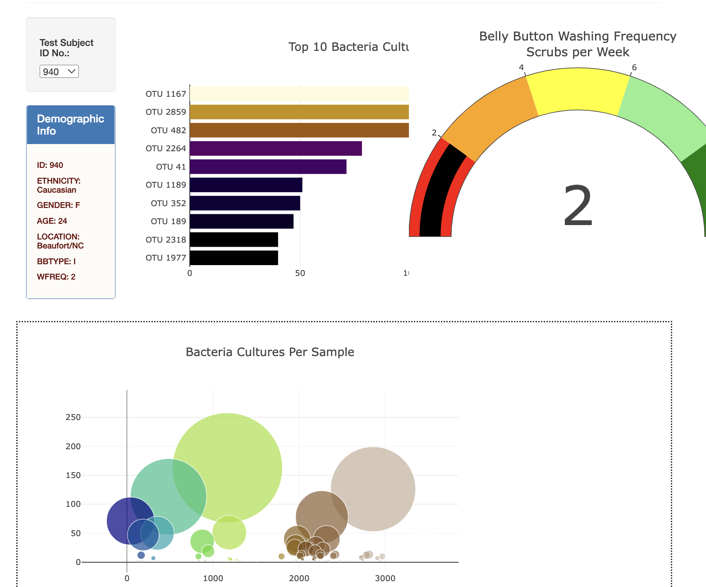

# Data Visualization in JavaScript with Plotly: Belly Button Biodiversity
A classwork example in which a Plotly dashboard is created and displayed on an HTML webpage to show Plotly graphs.

---

# Overview
In this classwork example, "a biological researcher in a prominent microbiology labratory" collected demographic information from bacteria that came from volunteers' belly buttons. Researchers are wanting to discover new sources of bacteria that are in high demand in a special industry - the imitation beef industry. The goal is to locate bacterias that have the ability to synthesize proteins that taste like beef for the manufacturing company "Improbable Beef". 

## Purpose 
Based on this belly button biodiversity data, we created a interactive HTML dashboard to visulize each volunteer's bacteria makeup. This will assist the researchers as they visualize common factors in the volunteer's belly button biodiversity.

---

# Results

If a static server is used, index.html and all other files will display an interactive webpage that will display several graphs if a volunteer's ID number is picked from a drop down menu.

